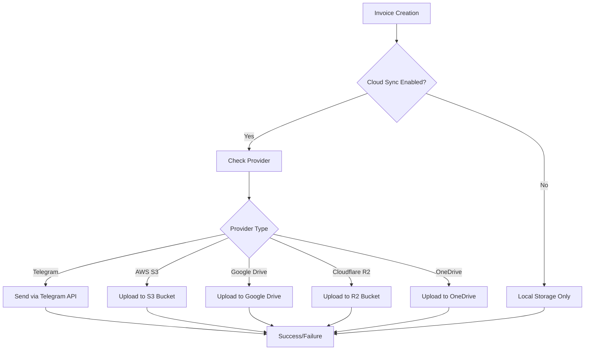

# Deploying GST Zen to Netlify with Automatic Invoice Cloud Storage

## 1. Overview

This document outlines the design for deploying the GST Zen application to Netlify with automatic uploading of generated invoices to cloud storage. The solution will leverage Netlify's deployment capabilities while integrating with multiple cloud storage providers (Telegram, AWS S3, Google Drive, Cloudflare R2, and OneDrive) for automatic invoice backup.

## 2. Current Architecture

### 2.1 Application Structure
- **Frontend**: React + TypeScript + Vite
- **Backend**: Supabase (PostgreSQL with real-time capabilities)
- **State Management**: React Query for server state
- **Storage Settings**: Configured via `StorageSettingsDialog` component
- **Invoice Generation**: PDF generation using browser print functionality

### 22.2 Invoice Generation Flow
1. User creates an invoice through the UI
2. Invoice data is stored in Supabase
3. PDF is generated using `generateInvoicePDF` function
4. If Telegram is configured, invoice is automatically sent via `sendInvoiceToTelegram`
5. Currently, only Telegram integration is fully implemented

### 2.3 Current Cloud Storage Implementation
- **Telegram**: Fully implemented with `sendFileToTelegram` function
- **Other Providers**: Configuration UI exists but implementation is missing

## 3. Deployment to Netlify

### 3.1 Build Process
- Uses `npm run build` command to generate static assets
- Output directory: `dist/`
- Environment variables configured in Netlify dashboard

### 3.2 Required Environment Variables
- `VITE_SUPABASE_URL` - Supabase project URL
- `VITE_SUPABASE_ANON_KEY` - Supabase anonymous key
- Provider-specific credentials (configured in UI)

## 4. Cloud Storage Integration Design

### 4.1 Architecture Overview


### 4.2 Implementation Strategy

#### 4.2.1 Telegram Integration (Already Implemented)
- Uses `sendFileToTelegram` function from `telegram.ts`
- Called automatically after invoice creation when Telegram is configured

#### 4.2.2 AWS S3 Integration
- Use `@aws-sdk/client-s3` package (already in dependencies)
- Create `uploadToS3` function in a new `src/lib/aws-s3.ts` file
- Implement upload functionality using AWS credentials from storage settings

#### 4.2.3 Google Drive Integration
- Would require Google Drive API client
- Create `uploadToGoogleDrive` function in `src/lib/google-drive.ts`
- Handle OAuth2 authentication flow

#### 4.2.4 Cloudflare R2 Integration
- R2 is S3-compatible, so can use AWS SDK
- Create `uploadToR2` function in `src/lib/cloudflare-r2.ts`
- Use Cloudflare credentials from storage settings

#### 4.2.5 OneDrive Integration
- Would require Microsoft Graph API
- Create `uploadToOneDrive` function in `src/lib/onedrive.ts`
- Handle OAuth2 authentication flow

## 5. Implementation Plan

### 5.1 Core Implementation Steps

#### Step 1: Enhance Storage Settings Handling
- Modify `useCreateInvoice` hook to support all cloud providers
- Add provider-specific upload functions
- Implement error handling and retry logic

#### Step 2: Implement AWS S3 Integration
```typescript
// src/lib/aws-s3.ts
import { S3Client, PutObjectCommand } from "@aws-sdk/client-s3";

export const uploadToS3 = async (
  file: Blob,
  filename: string,
  settings: {
    awsAccessKey: string;
    awsSecretKey: string;
    awsBucketName: string;
    awsRegion: string;
  }
): Promise<boolean> => {
  try {
    const s3Client = new S3Client({
      region: settings.awsRegion,
      credentials: {
        accessKeyId: settings.awsAccessKey,
        secretAccessKey: settings.awsSecretKey,
      },
    });

    const command = new PutObjectCommand({
      Bucket: settings.awsBucketName,
      Key: filename,
      Body: file,
    });

    await s3Client.send(command);
    return true;
  } catch (error) {
    console.error("S3 upload error:", error);
    return false;
  }
};
```

#### Step 3: Implement Cloudflare R2 Integration
```typescript
// src/lib/cloudflare-r2.ts
import { S3Client, PutObjectCommand } from "@aws-sdk/client-s3";

export const uploadToR2 = async (
  file: Blob,
  filename: string,
  settings: {
    cloudflareAccountId: string;
    cloudflareAccessKeyId: string;
    cloudflareSecretAccessKey: string;
    cloudflareBucketName: string;
  }
): Promise<boolean> => {
  try {
    const s3Client = new S3Client({
      region: "auto",
      endpoint: `https://${settings.cloudflareAccountId}.r2.cloudflarestorage.com`,
      credentials: {
        accessKeyId: settings.cloudflareAccessKeyId,
        secretAccessKey: settings.cloudflareSecretAccessKey,
      },
    });

    const command = new PutObjectCommand({
      Bucket: settings.cloudflareBucketName,
      Key: filename,
      Body: file,
    });

    await s3Client.send(command);
    return true;
  } catch (error) {
    console.error("R2 upload error:", error);
    return false;
  }
};
```

#### Step 4: Update Invoice Creation Hook
Modify `useCreateInvoice` in `src/hooks/useInvoices.ts` to handle all providers:

```typescript
// In onSuccess callback of useCreateInvoice
if (settings.enableCloudSync && settings.cloudProvider) {
  switch (settings.cloudProvider) {
    case 'telegram':
      // Existing implementation
      break;
    case 'aws':
      // Call uploadToS3 function
      break;
    case 'cloudflare':
      // Call uploadToR2 function
      break;
    case 'google-drive':
      // Call uploadToGoogleDrive function
      break;
    case 'onedrive':
      // Call uploadToOneDrive function
      break;
  }
}
```

### 5.2 Netlify Deployment Configuration

#### 5.2.1 Build Settings
- **Base directory**: `/`
- **Build command**: `npm run build`
- **Publish directory**: `dist`

#### 5.2.2 Environment Variables
Set in Netlify dashboard under Site settings > Build & deploy > Environment:
```
VITE_SUPABASE_URL=your_supabase_url
VITE_SUPABASE_ANON_KEY=your_supabase_anon_key
```

## 6. Security Considerations

### 6.1 Credential Management
- All cloud provider credentials stored in localStorage (encrypted)
- Never expose credentials in client-side code
- Use environment variables for sensitive configuration when possible

### 6.2 Data Privacy
- Invoices contain sensitive business information
- Ensure secure transmission using HTTPS
- Follow provider-specific security best practices

## 7. Testing Strategy

### 7.1 Unit Tests
- Test each cloud provider integration function
- Mock API calls to avoid actual uploads during testing
- Verify error handling and retry logic

### 7.2 Integration Tests
- Test complete invoice creation to cloud upload flow
- Verify file integrity after upload
- Test with various file sizes and formats

### 7.3 Manual Testing
- Deploy to Netlify test environment
- Create test invoices and verify uploads
- Test all cloud provider configurations

## 8. Monitoring and Error Handling

### 8.1 Error Handling
- Implement retry mechanism for failed uploads
- Provide user feedback on upload status
- Log errors for debugging

### 8.2 Monitoring
- Track successful/failed uploads
- Monitor for credential expiration
- Alert on repeated failures

## 9. Future Enhancements

### 9.1 Additional Providers
- Dropbox integration
- FTP/SFTP support
- Custom webhook endpoints

### 9.2 Advanced Features
- Batch upload processing
- Upload scheduling
- File versioning
- Backup rotation policies

## 10. Conclusion

This design provides a comprehensive solution for automatically uploading generated invoices to cloud storage when deploying GST Zen to Netlify. The implementation leverages existing infrastructure while extending support to multiple cloud providers. The modular approach ensures maintainability and allows for future enhancements.